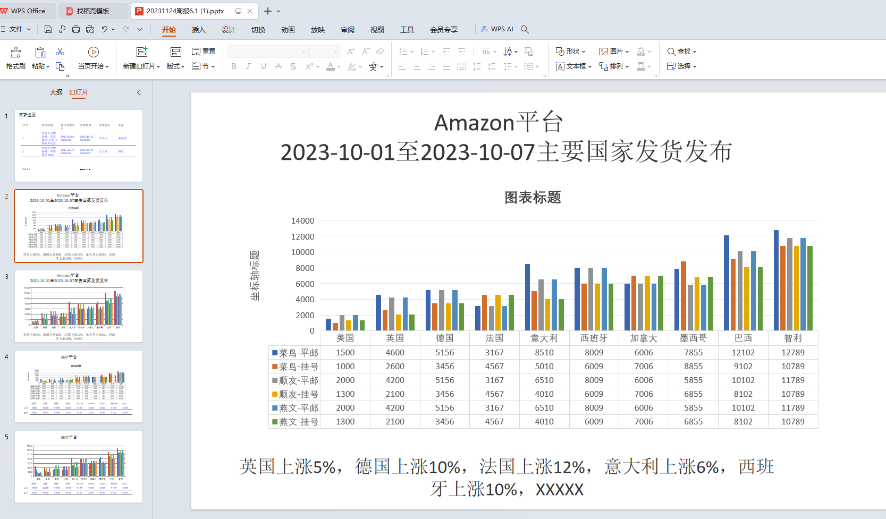
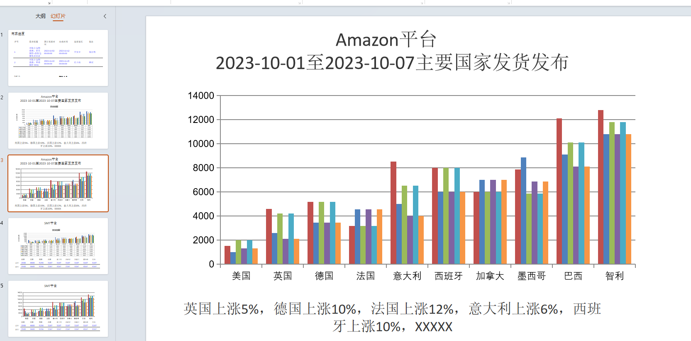

# estonedemo
vue2公共项目搭建
+ 1.涉及vuex永久存储
+ 2.axios 封装
+ 3.窗口监听

+ 4.vue.config配置

+ 5.ViewUI组件库搭建 view-design

+ 6.vuex初步搭建

插件引入并使用
+ 7.js-export-excel 表格导出
+ 8.lodash  是一个一致性、模块化、高性能的 JavaScript 实用工具库
+ 9.moment 时间相关
+ 10.js-cookie  cookie 相关
+ 11.vxe-table  xe-utils 虚拟滚动相关
+ 12.js-base64  加密、解密相关(编码和解码base64数据)
+ 13.SHA256  加密、解密相关(编码和解码base64数据) 是一种哈希算法，它可以将任意长度的数据转换为256位的哈希值(即64个十六进制字符)
+ 14.新增导出ppt功能
## Project setup
```
npm install
```

### Compiles and hot-reloads for development
```
npm run dev
```

### Compiles and minifies for production
```
npm run build
```

### Lints and fixes files
```
npm run lint
```

### Customize configuration
See [Configuration Reference](https://cli.vuejs.org/config/).

## 功能14
npm安装
```sh
npm install pptxgenjs --save
```
### 使用1
```js
// 引入PptxGenJS库
import PptxGenJS from "pptxgenjs";

// 创建PptxGenJS实例
const pptx = new PptxGenJS();

// 添加一个带有文本的幻灯片
const slide = pptx.addSlide();
slide.addText("Hello, PPT!", { x: 1, y: 1, font_size: 18 });

// 添加另一个带有文本的幻灯片
const slide2 = pptx.addSlide();
slide2.addText("second Slide PPT", { x: 1, y: 1, font_size: 18 });

// 保存PPTX文件
pptx.save("presentation");
```
### 使用2
```js
// 引入PptxGenJS库
import PptxGenJS from "pptxgenjs";

exportPPT(){
  // 创建PptxGenJS实例
  const pptx = new PptxGenJS();

  // 添加一个带有文本的幻灯片
  const slide = pptx.addSlide();
  slide.addText("Hello, PPT!", { x: 1, y: 1, font_size: 18 });

  // 添加另一个带有文本的幻灯片
  const slide2 = pptx.addSlide();
  slide2.addText("second Slide PPT", { x: 1, y: 1, font_size: 18 });

  // 保存PPTX文件
  pptx.save("presentation");
}
```



